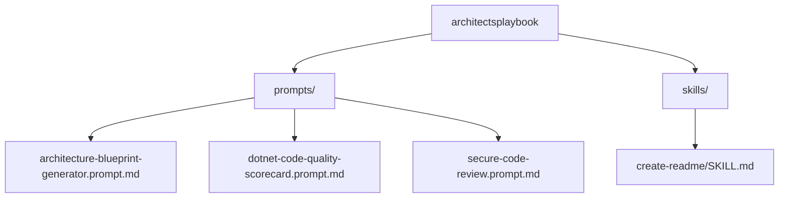

# Architect's Playbook

A curated collection of GitHub Copilot prompts and skills for software architecture, code quality, and security review tasks. Use these assets with GitHub Copilot (Copilot Chat, Copilot CLI, or any Copilot agent-enabled tool) to accelerate common architect and senior-engineer workflows.

## Overview

This repository packages reusable Copilot **prompts** and **skills** as plain Markdown files so they can be dropped into any project's `.github/prompts` or Copilot skills folder. Each asset is self-contained, versionable, and reviewable like any other piece of source.

| Type | Location | Purpose |
|---|---|---|
| Prompt | `prompts/architecture-blueprint-generator.prompt.md` | Generates a comprehensive architecture blueprint document with diagrams, patterns, and extension guidance. |
| Prompt | `prompts/dotnet-code-quality-scorecard.prompt.md` | Scores the maintainability and overall quality of a .NET solution, project by project. |
| Prompt | `prompts/secure-code-review.prompt.md` | Performs a prioritized, evidence-based secure code review. |
| Skill | `skills/create-readme/SKILL.md` | Generates a README.md for a project following a consistent structure and tone. |

## Getting Started

### Prerequisites

- GitHub Copilot access (Copilot Chat, Copilot CLI, or another Copilot agent-enabled surface) that supports custom prompt and skill files.
- Git, to clone this repository or copy individual files into your own project.

### Usage

1. Clone the repository:

   ```bash
   git clone https://github.com/dbottjer/architectsplaybook.git
   ```

2. Copy the prompt or skill file you need into your target project (for example, `.github/prompts/` for prompts consumed by Copilot Chat, or your tool's skills directory).
3. Invoke the prompt/skill from your Copilot surface. Each file's front matter (`name`, `description`, `agent`) tells the host tool how to present and run it.

### Repository Layout



## Prompt and Skill Reference

### architecture-blueprint-generator

Auto-detects project type and architectural pattern (Clean Architecture, Microservices, Layered, MVVM, MVC, Hexagonal, Event-Driven, Serverless, Monolithic) and produces a `Project_Architecture_Blueprint.md` covering component structure, cross-cutting concerns, data architecture, testing, deployment, and extension guidance. Supports configurable detail level and optional Mermaid/C4/UML diagrams.

### dotnet-code-quality-scorecard

Reviews an entire .NET solution and assigns a 1–100 maintainability and overall quality score per project and for the solution as a whole, based on pattern usage, coupling, naming conventions, and C# best practices, with improvement recommendations.

### secure-code-review

Runs an evidence-first secure code review focused on input validation, secrets/config handling, logging redaction, access control, and environment-specific behavior. Produces a prioritized findings report with strengths, security observations, code quality notes, and next steps.

### create-readme

Generates a README.md for a project: reviews the codebase, follows a consistent section structure (Overview, Getting Started, dependencies, authentication, service type, etc.), and uses Mermaid diagrams where applicable.

## Related Resources

- [adr-generator agent (awesome-copilot)](https://github.com/github/awesome-copilot/blob/main/agents/adr-generator.agent.md) — a complementary community agent for generating Architecture Decision Records, useful alongside the architecture blueprint prompt in this repository.
